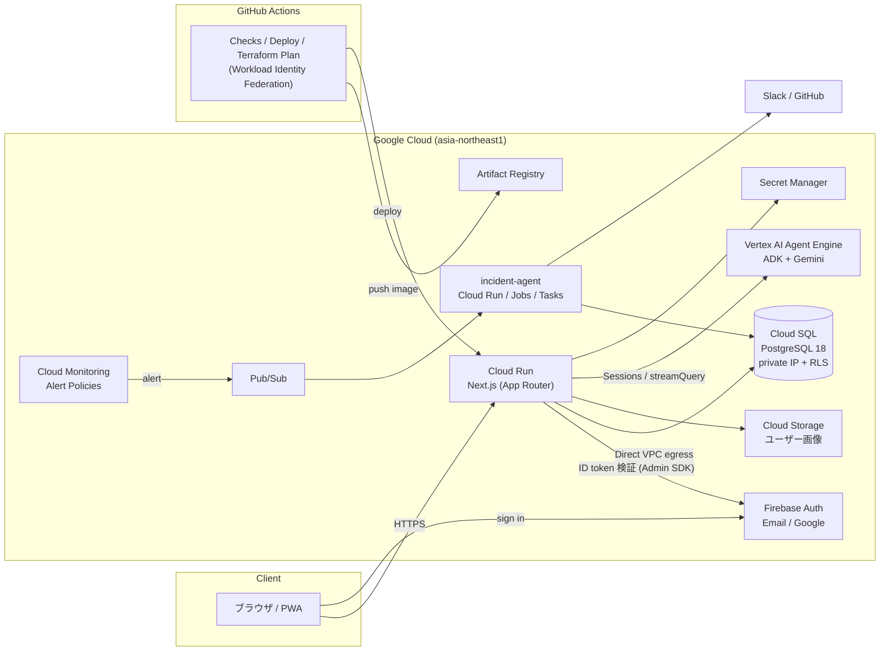
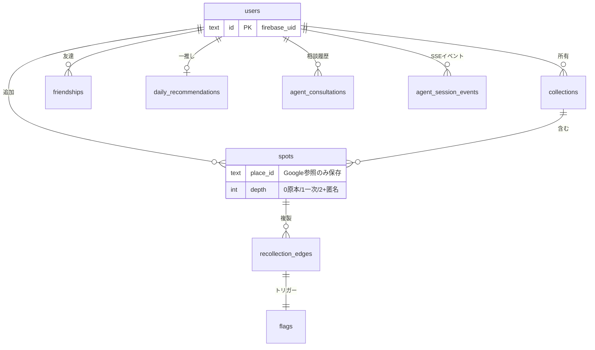

# mogu

Next.js アプリと Google Cloud インフラ（Terraform）を 1 つのリポジトリで管理する
モノレポです。AI Agent と人間が安全に共同作業できるよう、ルール・スクリプト・
スキルを整備しています。

## アーキテクチャ



- **認証**: Firebase Authentication（Email/Password + Google）。API は Bearer
  トークン検証、DB は PostgreSQL RLS で自分の行のみアクセス可能
- **CI/CD**: GitHub Actions + Workload Identity Federation（SA キーレス）。
  `main` への push で変更パス別に web / incident-agent を自動デプロイ。
  PR では web / incident-agent のチェックと、Terraform 変更時の plan を実行
- **コスト**: Cloud Run はゼロスケール、Cloud SQL は最小構成、予算アラートを
  Slack に通知

## 技術スタック

| レイヤー | 技術 |
|----------|------|
| フロントエンド / API | Next.js 16 (App Router) / TypeScript |
| AI | Vertex AI Agent Engine (ADK) / Gemini 2.5 Flash |
| 認証 | Firebase Authentication |
| データベース | Cloud SQL for PostgreSQL 18 (Prisma + RLS) |
| オブジェクトストレージ | Cloud Storage |
| インフラ | Terraform (Google Cloud) |
| CI/CD | GitHub Actions (WIF) |

## リポジトリ構成

```
apps/web/                 Next.js アプリケーション
agents/                   Vertex AI Agent Engine ソース
services/incident-agent/ 自律インシデント Agent
terraform/                Terraform (modules + environments/dev)
scripts/                  ローカル / CI 共用スクリプト
.github/workflows/        web / incident-agent / Terraform CI/CD
docs/                     詳細ドキュメント
```

## クイックスタート（ローカル開発）

```bash
# Node.js 24+ / pnpm 11 / Firebase CLI が必要
cp apps/web/.env.example apps/web/.env

# Terminal 1: Firebase Auth Emulator
firebase emulators:start --only auth --project demo-mogu

# Terminal 2: アプリ
cd apps/web && pnpm install && pnpm dev
```

http://localhost:3000 を開くと `/login` にリダイレクトされます。

上記だけでもログイン画面は確認できますが、サインアップ後のホームには
PostgreSQL とマイグレーション済みスキーマが必要です。Cloud SQL Auth Proxy
またはローカル PostgreSQL を用意し、`DATABASE_URL` を設定して
`pnpm db:migrate` を実行してください。検索タブの AI 相談、Maps / Places まで
動かすための環境変数と Agent Engine の手順は
[セットアップ & 運用ガイド](docs/SETUP.md) を参照してください。

## データモデル

Cloud SQL はスポット / コレクション / 友達 / フラグに加え、相談履歴の
スナップショットと SSE 再接続用イベントを RLS 配下で保持します。進行中の
エージェント会話の短期文脈は Vertex AI Agent Engine Sessions が保持します。



主要な ERD・DDL・RLS は [docs/erd-api.md](docs/erd-api.md)、エージェント永続化の
実装は [Prisma schema](apps/web/prisma/schema.prisma) を参照。

## ドキュメント

- [確定仕様 v1](docs/spec.md) — 用語・画面・型・ガードレール
- [ERD / API 定義 v1](docs/erd-api.md) — DDL・RLS・API 概要
- [OpenAPI v1](docs/openapi.yaml) — 主要 REST 契約（相談履歴 API は実装追従中）
- [機能一覧 v1](docs/features.md) — MVP / 磨き / 将来枠
- [セットアップ & 運用ガイド](docs/SETUP.md) — インフラ構築、デプロイ、
  DB マイグレーション、Firebase 設定、監視の詳細手順
- [incident-agent 仕様](docs/incident-agent.md) — 自律調査、outbox、Slack対話
- [incident-agent dev runbook](docs/incident-agent-dev-runbook.md) — dev有効化と運用
- [デザイントークン](docs/design-tokens.md) — ブランド、配色、余白、Elevation
- `AGENTS.md` — AI Agent 向けルール（リポジトリ全体 / `terraform/` / `apps/web/`）
