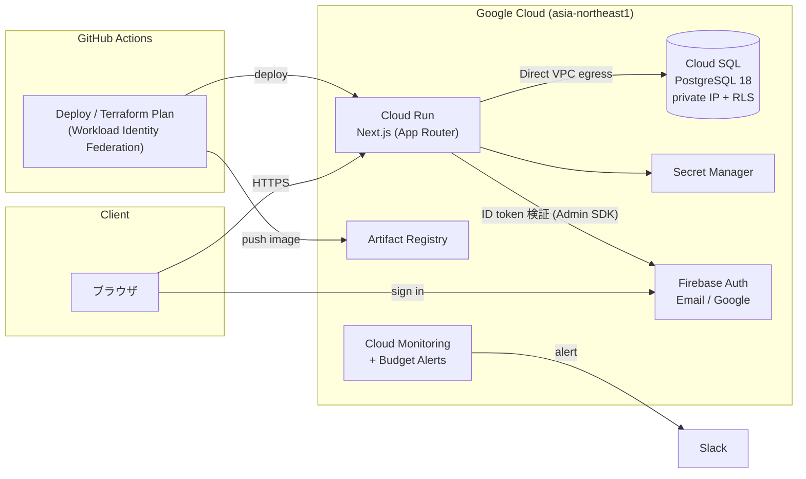

# mogu

Next.js アプリと Google Cloud インフラ（Terraform）を 1 つのリポジトリで管理する
モノレポです。AI Agent と人間が安全に共同作業できるよう、ルール・スクリプト・
スキルを整備しています。

## アーキテクチャ



- **認証**: Firebase Authentication（Email/Password + Google）。API は Bearer
  トークン検証、DB は PostgreSQL RLS で自分の行のみアクセス可能
- **CI/CD**: GitHub Actions + Workload Identity Federation（SA キーレス）。
  `main` への push で自動デプロイ、PR で Terraform plan を自動レビュー
- **コスト**: Cloud Run はゼロスケール、Cloud SQL は最小構成、予算アラートを
  Slack に通知

## 技術スタック

| レイヤー | 技術 |
|----------|------|
| フロントエンド / API | Next.js 16 (App Router) / TypeScript |
| 認証 | Firebase Authentication |
| データベース | Cloud SQL for PostgreSQL 18 (Prisma + RLS) |
| インフラ | Terraform (Google Cloud) |
| CI/CD | GitHub Actions (WIF) |

## リポジトリ構成

```
apps/web/     Next.js アプリケーション
terraform/    Terraform (modules + environments/dev)
scripts/      ローカル / CI 共用スクリプト
docs/         詳細ドキュメント
```

## クイックスタート（ローカル開発）

```bash
# Terminal 1: Firebase Auth Emulator
firebase emulators:start --only auth --project demo-mogu

# Terminal 2: アプリ（.env は apps/web/.env.example からコピー）
cd apps/web && pnpm install && pnpm dev
```

http://localhost:3000 を開くと `/login` にリダイレクトされます。

## ドキュメント

- [セットアップ & 運用ガイド](docs/SETUP.md) — インフラ構築、デプロイ、
  DB マイグレーション、Firebase 設定、監視の詳細手順
- `AGENTS.md` — AI Agent 向けルール（リポジトリ全体 / `terraform/` / `apps/web/`）
