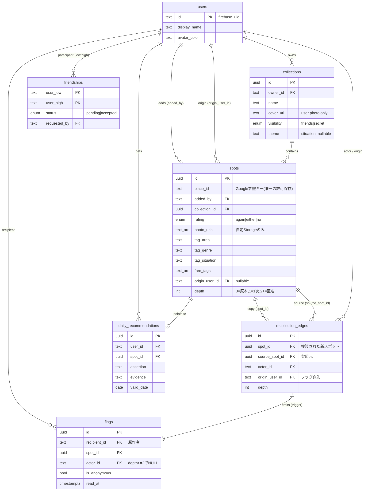

# mogu ERD / API 定義 v1

> `mogu 確定仕様 v1` の型定義(`types.ts`)を満たすDDLとAPI契約。用語・ガードレールは確定仕様書を正とする。
> 認可は **DAL + RLS 2層**。Firebase UID を各リクエストで `app.current_user_id` に注入する。
> ToS: **place_id のみ保存**。店名/住所/座標/Google写真は保存せず、表示時取得+帰属(新規実装は "Google Maps" 表記)。

---

## 1. ERD(関係図)



**設計の要点**

- 中核資産は `friendships`(トラストグラフ)+ `recollection_edges`(伝播グラフ)。Firestoreを捨ててPostgreSQLにした理由がここ。
- `savedCount`(輪でn人が保存)は**保存列にしない**。閲覧者の輪に相対的な読み取り時集計(§5参照)。
- 伝播1次限定(ガードレール2)は `depth` で表現し、フラグ発行トリガーで `depth>=2` の `actor_id` をNULL化して匿名性を**保存層で保証**。

---

## 2. DDL(PostgreSQL 18 / Cloud SQL)

```sql
-- ============================================================
-- 拡張
-- ============================================================
CREATE EXTENSION IF NOT EXISTS "pgcrypto";     -- gen_random_uuid()
-- CREATE EXTENSION IF NOT EXISTS vector;       -- Phase 2 (pgvector / RAG)

-- ============================================================
-- ENUM
-- ============================================================
CREATE TYPE rating                AS ENUM ('again', 'either', 'no'); -- また行きたい/どちらでも/また行きたくない
CREATE TYPE collection_visibility AS ENUM ('friends', 'secret');
CREATE TYPE friendship_status     AS ENUM ('pending', 'accepted');

-- ============================================================
-- ヘルパ関数(RLS)
-- ============================================================
-- 現在のリクエストユーザー。DAL が set_config('app.current_user_id', uid, true) で注入
CREATE OR REPLACE FUNCTION app_current_user() RETURNS text
  LANGUAGE sql STABLE AS
$$ SELECT current_setting('app.current_user_id', true) $$;

-- 友達判定。呼び出し側(current_user)が必ず当事者なので friendships の
-- 当事者可視ポリシー下で行が見え、SECURITY DEFINER は不要
CREATE OR REPLACE FUNCTION are_friends(a text, b text) RETURNS boolean
  LANGUAGE sql STABLE AS
$$
  SELECT EXISTS (
    SELECT 1 FROM friendships f
    WHERE f.status = 'accepted'
      AND f.user_low  = LEAST(a, b)
      AND f.user_high = GREATEST(a, b)
  )
$$;

-- ============================================================
-- users : 名前とアバターのみ公開(存在は公開・中身は非公開)
-- ============================================================
CREATE TABLE users (
  id           text PRIMARY KEY,                 -- firebase_uid
  display_name text NOT NULL,
  avatar_color text NOT NULL DEFAULT '#888888',
  avatar_url   text,                             -- GCS photo avatar (#259); null → color + initial
  created_at   timestamptz NOT NULL DEFAULT now()
);
ALTER TABLE users ENABLE ROW LEVEL SECURITY;
ALTER TABLE users FORCE  ROW LEVEL SECURITY;

CREATE POLICY users_select_public ON users            -- 存在(名前・アバター)は検索可
  FOR SELECT USING (true);
CREATE POLICY users_insert_self ON users
  FOR INSERT WITH CHECK (id = app_current_user());
CREATE POLICY users_update_self ON users
  FOR UPDATE USING (id = app_current_user())
             WITH CHECK (id = app_current_user());

-- ============================================================
-- friendships : 相互承認ゲート(正規化ペア low<high)
-- ============================================================
CREATE TABLE friendships (
  user_low     text NOT NULL REFERENCES users(id),
  user_high    text NOT NULL REFERENCES users(id),
  status       friendship_status NOT NULL DEFAULT 'pending',
  requested_by text NOT NULL REFERENCES users(id),
  created_at   timestamptz NOT NULL DEFAULT now(),
  accepted_at  timestamptz,
  PRIMARY KEY (user_low, user_high),
  CHECK (user_low < user_high)                    -- 正規化を強制(重複辺を防ぐ)
);
ALTER TABLE friendships ENABLE ROW LEVEL SECURITY;
ALTER TABLE friendships FORCE  ROW LEVEL SECURITY;

CREATE POLICY friendships_select ON friendships       -- 当事者のみ
  FOR SELECT USING (user_low = app_current_user() OR user_high = app_current_user());
CREATE POLICY friendships_insert ON friendships       -- 申請者=自分、かつ当事者
  FOR INSERT WITH CHECK (
    requested_by = app_current_user()
    AND (user_low = app_current_user() OR user_high = app_current_user())
  );
CREATE POLICY friendships_update ON friendships       -- 承認/更新(当事者のみ。自己承認はアプリで抑止)
  FOR UPDATE USING (user_low = app_current_user() OR user_high = app_current_user())
             WITH CHECK (user_low = app_current_user() OR user_high = app_current_user());
CREATE POLICY friendships_delete ON friendships       -- 申請取り消し(pending) / 拒否(pending) / 解除(accepted)。詳細はアプリ層
  FOR DELETE USING (
    (user_low = app_current_user() OR user_high = app_current_user())
    AND status IN ('pending', 'accepted')
  );

-- ============================================================
-- collections
-- ============================================================
CREATE TABLE collections (
  id          uuid PRIMARY KEY DEFAULT gen_random_uuid(),
  owner_id    text NOT NULL REFERENCES users(id),
  name        text NOT NULL,
  description text,
  cover_url   text,                               -- ユーザー写真のみ。Google素材の加工カバー禁止
  visibility  collection_visibility NOT NULL DEFAULT 'friends',
  theme       text,                               -- シチュエーション(任意/nullable)
  created_at  timestamptz NOT NULL DEFAULT now(),
  updated_at  timestamptz NOT NULL DEFAULT now()
);
ALTER TABLE collections ENABLE ROW LEVEL SECURITY;
ALTER TABLE collections FORCE  ROW LEVEL SECURITY;

CREATE POLICY collections_select ON collections
  FOR SELECT USING (
    owner_id = app_current_user()
    OR (visibility = 'friends' AND are_friends(owner_id, app_current_user()))
    -- secret は所有者のみ(伝播も通知もしない)
  );
CREATE POLICY collections_insert ON collections
  FOR INSERT WITH CHECK (owner_id = app_current_user());
CREATE POLICY collections_update ON collections
  FOR UPDATE USING (owner_id = app_current_user())
             WITH CHECK (owner_id = app_current_user());
CREATE POLICY collections_delete ON collections
  FOR DELETE USING (owner_id = app_current_user());

-- ============================================================
-- spots : place_id 参照 + 個人付与情報。Google由来データは保存しない
-- ============================================================
CREATE TABLE spots (
  id             uuid PRIMARY KEY DEFAULT gen_random_uuid(),
  place_id       text NOT NULL,                   -- Google参照キー(唯一の許可保存)
  added_by       text NOT NULL REFERENCES users(id),
  collection_id  uuid NOT NULL REFERENCES collections(id) ON DELETE CASCADE,
  photo_urls     text[] NOT NULL DEFAULT '{}',    -- 自前Cloud Storage(ユーザー撮影)のみ
  comment        text   NOT NULL DEFAULT '',
  rating         rating NOT NULL,
  tag_area       text,                            -- 第1層 構造化タグ(=S1検索チップ=検索キー)
  tag_genre      text,
  tag_situation  text,
  free_tags      text[] NOT NULL DEFAULT '{}',    -- 第2層 自由タグ(聞き上手エージェント生成含む)
  origin_user_id text REFERENCES users(id),       -- 原作者(伝播クレジット)。原本はNULL
  depth          int  NOT NULL DEFAULT 0,         -- 0=原本 / 1=1次 / 2+=匿名クレジット
  created_at     timestamptz NOT NULL DEFAULT now(),
  updated_at     timestamptz NOT NULL DEFAULT now()
);
ALTER TABLE spots ENABLE ROW LEVEL SECURITY;
ALTER TABLE spots FORCE  ROW LEVEL SECURITY;

-- 閲覧可否は「親コレクションが見えるか」に従属
CREATE POLICY spots_select ON spots
  FOR SELECT USING (
    added_by = app_current_user()
    OR EXISTS (
      SELECT 1 FROM collections c
      WHERE c.id = spots.collection_id
        AND ( c.owner_id = app_current_user()
              OR (c.visibility = 'friends' AND are_friends(c.owner_id, app_current_user())) )
    )
  );
CREATE POLICY spots_insert ON spots
  FOR INSERT WITH CHECK (
    added_by = app_current_user()
    AND EXISTS (SELECT 1 FROM collections c
                WHERE c.id = collection_id AND c.owner_id = app_current_user())
  );
CREATE POLICY spots_update ON spots
  FOR UPDATE USING (added_by = app_current_user())
             WITH CHECK (added_by = app_current_user());
CREATE POLICY spots_delete ON spots
  FOR DELETE USING (added_by = app_current_user());

-- ============================================================
-- recollection_edges : 伝播グラフ
-- ============================================================
CREATE TABLE recollection_edges (
  id             uuid PRIMARY KEY DEFAULT gen_random_uuid(),
  spot_id        uuid NOT NULL REFERENCES spots(id) ON DELETE CASCADE,  -- 新しく作られた複製スポット
  source_spot_id uuid NOT NULL REFERENCES spots(id) ON DELETE SET NULL, -- 参照元スポット
  actor_id       text NOT NULL REFERENCES users(id),                    -- リコレクションした人
  origin_user_id text NOT NULL REFERENCES users(id),                    -- 原作者(フラグ宛先)
  depth          int  NOT NULL,                                         -- source.depth + 1
  created_at     timestamptz NOT NULL DEFAULT now()
);
ALTER TABLE recollection_edges ENABLE ROW LEVEL SECURITY;
ALTER TABLE recollection_edges FORCE  ROW LEVEL SECURITY;

CREATE POLICY recollection_select ON recollection_edges    -- 当事者(actor / origin)のみ
  FOR SELECT USING (actor_id = app_current_user() OR origin_user_id = app_current_user());
CREATE POLICY recollection_insert ON recollection_edges
  FOR INSERT WITH CHECK (actor_id = app_current_user());

-- ============================================================
-- flags : 静かな承認通知(本人にのみ見える)
-- INSERT はトリガー経由(actor≠recipient のため RLS を貫通させる必要がある)
-- ============================================================
CREATE TABLE flags (
  id           uuid PRIMARY KEY DEFAULT gen_random_uuid(),
  recipient_id text NOT NULL REFERENCES users(id),          -- 原作者
  spot_id      uuid REFERENCES spots(id) ON DELETE SET NULL,
  actor_id     text REFERENCES users(id),                   -- depth>=2 では NULL(匿名)
  is_anonymous boolean NOT NULL DEFAULT false,               -- depth >= 2
  created_at   timestamptz NOT NULL DEFAULT now(),
  read_at      timestamptz
);
ALTER TABLE flags ENABLE ROW LEVEL SECURITY;
ALTER TABLE flags FORCE  ROW LEVEL SECURITY;

CREATE POLICY flags_select_self ON flags
  FOR SELECT USING (recipient_id = app_current_user());
CREATE POLICY flags_update_self ON flags                    -- 既読化のみ
  FOR UPDATE USING (recipient_id = app_current_user())
             WITH CHECK (recipient_id = app_current_user());

-- recollection_edges INSERT で原子的にフラグ発行。
-- depth>=2 は actor_id を落として匿名性を保存層で保証。自己リコレクションは発火しない。
CREATE OR REPLACE FUNCTION emit_flag_on_recollection() RETURNS trigger
  LANGUAGE plpgsql SECURITY DEFINER AS
$$
BEGIN
  IF NEW.actor_id = NEW.origin_user_id THEN
    RETURN NEW;                                -- 自分の店を自分で取り込んでも通知しない
  END IF;
  INSERT INTO flags (recipient_id, spot_id, actor_id, is_anonymous)
  VALUES (
    NEW.origin_user_id,
    NEW.spot_id,
    CASE WHEN NEW.depth >= 2 THEN NULL ELSE NEW.actor_id END,
    NEW.depth >= 2
  );
  RETURN NEW;
END;
$$;

CREATE TRIGGER trg_emit_flag
  AFTER INSERT ON recollection_edges
  FOR EACH ROW EXECUTE FUNCTION emit_flag_on_recollection();

-- ============================================================
-- daily_recommendations : 一推し(エージェント生成テキスト。Google内容は含まない)
-- ============================================================
CREATE TABLE daily_recommendations (
  id           uuid PRIMARY KEY DEFAULT gen_random_uuid(),
  user_id      text NOT NULL REFERENCES users(id),
  spot_id      uuid NOT NULL REFERENCES spots(id) ON DELETE CASCADE,
  assertion    text NOT NULL,                    -- 断言の一文(自前生成)
  evidence     text NOT NULL,                    -- 例「Kenが『また行きたい』・輪で4人が保存」
  valid_date   date NOT NULL,
  generated_at timestamptz NOT NULL DEFAULT now(),
  UNIQUE (user_id, valid_date)
);
ALTER TABLE daily_recommendations ENABLE ROW LEVEL SECURITY;
ALTER TABLE daily_recommendations FORCE  ROW LEVEL SECURITY;
CREATE POLICY daily_reco_select_self ON daily_recommendations
  FOR SELECT USING (user_id = app_current_user());

-- ============================================================
-- インデックス
-- ============================================================
CREATE INDEX idx_spots_place        ON spots (place_id);                        -- 「輪でn人が保存」集計
CREATE INDEX idx_spots_collection   ON spots (collection_id);
CREATE INDEX idx_spots_added_by     ON spots (added_by);
CREATE INDEX idx_spots_tags         ON spots (tag_area, tag_genre, tag_situation); -- S1検索チップ
CREATE INDEX idx_spots_freetags     ON spots USING GIN (free_tags);
CREATE INDEX idx_collections_owner  ON collections (owner_id);
CREATE INDEX idx_flags_recipient    ON flags (recipient_id, created_at DESC);
CREATE INDEX idx_reco_edges_origin  ON recollection_edges (origin_user_id);
CREATE INDEX idx_reco_edges_actor   ON recollection_edges (actor_id);
```

### Phase 2(pgvector / RAG)

```sql
-- 埋め込みは gemini-embedding-001 を明示指定(デフォルト埋め込みは英語専用のため日本語では必須)
-- CREATE TABLE spot_embeddings (
--   spot_id    uuid PRIMARY KEY REFERENCES spots(id) ON DELETE CASCADE,
--   embedding  vector(768),      -- 出力次元は 768 / 1536 / 3072 から選択可
--   model      text NOT NULL DEFAULT 'gemini-embedding-001',
--   updated_at timestamptz NOT NULL DEFAULT now()
-- );
-- CREATE INDEX ON spot_embeddings USING hnsw (embedding vector_cosine_ops);
```

---

## 3. リコレクションのトランザクション(アプリ層の手順)

`POST /spots/{id}/recollect` は1トランザクション内で以下を実行する。

1. 参照元スポット `src` を取得(RLSで可視 = 友達のコレクション内であることが保証される)。
2. 新スポットを INSERT:
   `place_id=src.place_id`, `added_by=me`, `collection_id=<指定>`,
   `origin_user_id = COALESCE(src.origin_user_id, src.added_by)`,
   `depth = src.depth + 1`。写真/コメント/評価は**自分の入力**(未入力なら空)。
3. `recollection_edges` を INSERT(`actor_id=me`, `origin_user_id`, `depth`)。→ トリガーがフラグを自動発行。
4. **表示ルール(伝播1次限定)**: `depth <= 1` かつ閲覧者が origin の友達のときのみ、origin の写真/コメントを表示。`depth >= 2` は匿名クレジット(store情報+「誰かの推薦」)。
5. **secret コレクションは対象外**: `src` が secret ならそもそもRLSで見えないため、伝播・通知は構造的に発生しない。

---

## 4. API 定義(REST `/api/v1`)

### 認可フロー(全エンドポイント共通)

```
Authorization: Bearer <Firebase ID Token>
  → Firebase Admin SDK で検証 → uid 抽出
  → BEGIN;
    SELECT set_config('app.current_user_id', :uid, true);   -- txnローカル
    <RLS配下のクエリ>
    COMMIT;
```

DBはRLS対象の制限ロールで接続する(superuser / BYPASSRLS 不可)。`set_config` の第3引数 `true` でトランザクション終了時に自動リセット。

### エンドポイント一覧

> **OpenAPI 定義の正**: 機械可読な契約は `docs/openapi.yaml` を正とする。下表は人間向け概要。

| 分類 | Method | Path | Req(主) | Res型 |
| --- | --- | --- | --- | --- |
| ユーザー | POST | `/users` | `{displayName, avatarColor}` | `User` |
| ユーザー | PATCH | `/me` | `{displayName, avatarColor, avatarUrl?}` | `User` |
| | GET | `/me` | — | `Me` |
| | GET | `/me/badges` | — | `MeBadges` |
| | GET | `/users/search?q=` | — | `User[]`(id/name/avatarのみ) |
| 友達 | POST | `/friends/requests` | `{toUserId}` | `{pairId, status}` |
| | GET | `/friends/requests` | `?box=in\|out` | `FriendRequest[]` |
| | POST | `/friends/requests/{pairId}/accept` | — | `{status:'accepted'}` |
| | POST | `/friends/requests/{pairId}/reject` | — | `{status:'rejected'}` |
| | DELETE | `/friends/requests/{pairId}` | — | `204`（送信者による申請取り消し） |
| | DELETE | `/friends/{pairId}` | — | `204`（友達解除） |
| | GET | `/friends` | — | `User[]` |
| コレクション | POST | `/collections` | `{name, description?, visibility, theme?}` | `Collection` |
| | GET | `/collections?ownerId=` | — | `Collection[]`(RLS可視のみ) |
| | GET | `/collections/{id}` | — | `CollectionDetail` |
| | PATCH | `/collections/{id}` | 部分更新 | `Collection` |
| | DELETE | `/collections/{id}` | — | `204` |
| | GET | `/collections/{id}/suggestions` | — | `Spot[]`(末尾おすすめ/エージェント) |
| スポット | POST | `/collections/{id}/spots` | `CreateSpotRequest` | `Spot` |
| | PATCH | `/spots/{id}` | 部分更新 | `Spot` |
| | DELETE | `/spots/{id}` | — | `204` |
| | POST | `/spots/{id}/recollect` | `{targetCollectionId}` | `Spot`(自分の新複製) |
| | DELETE | `/spots/{id}/recollect` | — | `{savedCount}`（リコレクション解除・自分の複製を削除。`{id}` は参照元スポット。冪等） |
| ホーム/フィード | GET | `/feed?cursor=` | — | `FeedPage`(時系列・非アルゴリズム) |
| | GET | `/home/recommendation` | — | `Recommendation`(1枚) |
| 検索(エージェント) | POST | `/agent/sessions` | — | `{sessionId}` |
| | POST | `/agent/sessions/{id}/messages` | `{text, chips?}` | `AgentMessage` |
| | GET | `/agent/sessions/{id}/events` | SSE or ポーリング | 思考進行イベント |
| フラグ | GET | `/flags?weekOf=` | — | `FlagNotification[]`(集計) |
| | GET | `/flags/events` | — | `FlagEvent[]`(時系列) |
| | POST | `/flags/read` | `{ids?}` | `{updated:int}` |
| Places(参照) | GET | `/places/search?q=` | — | `PlaceSearchResult[]`(都度取得・非保存) |
| | GET | `/places/{placeId}` | — | `PlaceDTO`(都度取得・非保存) |

**クライアント状態(MVP)**: アバター行の新着リング既読はサーバに保存しない。`localStorage.lastReadFeedAt`(ISO8601) で管理する（`docs/spec.md` §5 参照）。

### API 型(`spec.md` §6 を拡張)

```typescript
export type Me = User & {
  counts: { collections: number; spots: number; friends: number }
}

export type MeBadges = {
  pendingFriendRequests: number
  unreadFlags: number
}

export type FriendRequest = {
  pairId: string              // friendships の正規化ペアキー
  from: Pick<User, 'id' | 'displayName' | 'avatarColor' | 'avatarUrl'>
  to: Pick<User, 'id' | 'displayName' | 'avatarColor' | 'avatarUrl'>
  status: 'pending' | 'accepted'
  createdAt: string
}

export type CollectionDetail = Collection & { spots: Spot[] }

export type FeedPage = {
  items: FeedItem[]
  nextCursor: string | null
}

export type AgentMessage = {
  role: 'agent'
  text: string
  thinking?: string[]
  recommendation?: Recommendation
  quickReplies?: string[]
}

export type AgentEvent = {
  type: 'thinking' | 'done'
  message: string
  timestamp: string
}

export type PlaceSearchResult = {
  placeId: string
  name: string
  address: string
}
```

### レスポンス整形の規約(サーバ側で注入)

- `Spot.savedCount` は**保存列ではなく読み取り時に注入**する(§5)。DTOに詰めてから返す。
- `Spot` を返す全経路で、`depth >= 2` の場合は `originUserId` を伏せ(`null`扱い)、写真/コメントを origin 由来のものに置換しない。
- `PlaceDTO`(表示用、**保存禁止**):
  ```typescript
  export type PlaceDTO = {
    placeId: string
    name: string
    address: string
    photos: { url: string; authorAttributions: { name: string; uri: string }[] }[]
    openNow?: boolean          // 鮮度シグナル(閉店検知)
    // ← Google Maps ロゴ帰属 + authorAttributions をUIで必須表示
  }
  ```

### エラーモデル

```json
{ "error": { "code": "forbidden", "message": "..." } }
```

| HTTP | code | 契機 |
| --- | --- | --- |
| 401 | `unauthorized` | トークン無し/無効 |
| 403 | `forbidden` | RLSで不可視/他人のリソース操作 |
| 404 | `not_found` | 存在しない/RLSで見えない |
| 409 | `conflict` | 友達申請の重複・コレクション名重複等 |
| 422 | `validation` | 型不一致・rating不正 |

---

## 5. 「輪でn人が保存」= 読み取り時集計(重要)

`savedCount` は閲覧者の輪に相対的。静的カラムにすると他人の輪の数字が漏れ、**数字の主語ルール(ガードレール1)に違反**する。サーバでスポットDTOを組み立てる際に、閲覧者(`app_current_user()`)基準で集計する。

```sql
-- 指定 place_id を、閲覧者の輪(自分+友達)の中で何人が保存しているか
SELECT count(DISTINCT s.added_by)
FROM spots s
WHERE s.place_id = :place_id
  AND ( s.added_by = app_current_user()
        OR are_friends(s.added_by, app_current_user()) );
```

**件数とフィード保存者プレビューの差(#284)**:

| 用途 | 自分を含むか | 理由 |
| --- | --- | --- |
| `savedCount`（バッジ・「グループでn人」） | **含む**（上式どおり） | 輪相対の店の数字。自分の保存も輪の一員 |
| フィードの保存者アバター行 / 代表者ラベル（`savedSavers`） | **含まない**（友達のみ） | 「誰が保存したか」の社会的証明。閲覧者自身を出さない |

MVP(シードデータ規模)では十分速い。将来 place_id×user の集計が重くなれば、輪の外に漏らさない前提でマテビュー化を検討(Phase 2)。

---

## 6. ガードレールとERDの対応(監査用)

| # | ガードレール | ERD/APIでの担保 |
| --- | --- | --- |
| 1 | 数字の主語ルール | 人の数字は保存しない/フラグは `recipient_id` にのみ可視。店の数字 `savedCount` は輪相対の読み取り時集計 |
| 2 | 伝播1次限定 | `spots.depth` + `emit_flag_on_recollection()` が `depth>=2` の `actor_id` をNULL化 |
| 3 | フィード非アルゴリズム | `/feed` は `created_at` 降順のみ。スコアリング列を持たない |
| 4 | FOMO装置なし | 消滅・ストリーク系のカラム/テーブルを定義しない |
| 5 | 店から金を受け取らない | 店舗・広告主・掲載費のテーブルが存在しない(構造で排除) |
| 6 | カバーにGoogle素材を加工しない | `cover_url` はユーザー写真のみ。Place Photos由来を格納しない |
| 7 | Google情報は非保存+都度取得 | 保存は `place_id` のみ。`/places/{placeId}` は非キャッシュ。表示は "Google Maps" 帰属 + `authorAttributions` 必須 |
